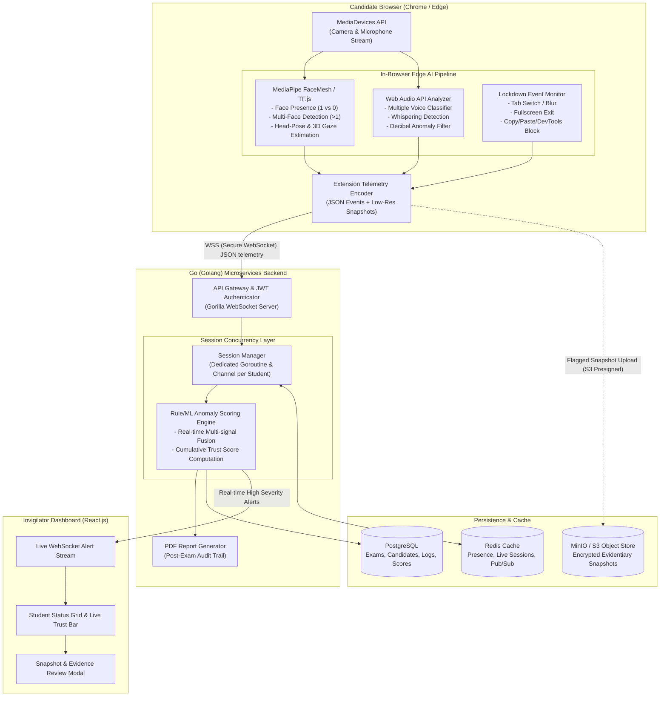

# 🛡️ ProctorSentinel (ExamGuard)

> **Next-Generation, Privacy-First Online Exam Proctoring System**  
> *An AI-Powered Browser Extension for Real-Time Camera- & Microphone-Based Proctoring with a High-Concurrency Go Backend.*

[](https://www.docker.com/)
[](https://golang.org/)
[](https://developer.chrome.com/docs/extensions/mv3/)
[](https://developers.google.com/mediapipe)
[](https://react.dev/)
[](https://www.postgresql.org/)
[](https://www.rknec.edu/)

---

## 📌 Table of Contents

1. [Executive Summary & Motivation](#-executive-summary--motivation)
2. [Key Differentiators & Research Gap](#-key-differentiators--research-gap)
3. [System Architecture](#-system-architecture)
4. [Component Deep Dive](#-component-deep-dive)
   - [A. Edge-AI & Browser Extension (Client)](#a-edge-ai--browser-extension-client)
   - [B. High-Concurrency Go Backend](#b-high-concurrency-go-backend)
   - [C. Real-Time Invigilator Dashboard](#c-real-time-invigilator-dashboard)
   - [D. Data & Storage Tier](#d-data--storage-tier)
5. [Event Telemetry & WebSocket Protocol](#-event-telemetry--websocket-protocol)
6. [Integrity & Trust Scoring Engine](#-integrity--trust-scoring-engine)
7. [Repository Structure](#-repository-structure)
8. [Local Development & Setup Guide](#-local-development--setup-guide)
9. [Testing & Benchmarking (k6)](#-testing--benchmarking-k6)
10. [Project Roadmap (12-Week Timeline)](#-project-roadmap-12-week-timeline)
11. [Project Team & Mentorship](#-project-team--mentorship)
12. [References](#-references)

---

## 🌟 Executive Summary & Motivation

The proliferation of online learning, university semester examinations, corporate recruitment drives, and large-scale entrance tests (e.g., JEE, NEET) has created an unprecedented demand for automated remote exam proctoring. 

### The Problem with Traditional Solutions
Legacy remote proctoring software (such as ProctorU, Examity, Respondus LockDown Browser):
- 🛑 **Heavy Native Installation**: Requires students to install invasive, OS-dependent native clients with root/administrator privileges.
- 🛑 **Massive Bandwidth & Cloud Costs**: Continuously streams raw 1080p/720p video and audio feeds to centralized cloud servers, incurring exorbitant bandwidth fees and crashing under mass-scale concurrency.
- 🛑 **Severe Privacy Risks**: Candidates are uncomfortable uploading hours of unencrypted raw webcam and ambient room audio recordings to third-party databases.
- 🛑 **Invigilator Fatigue**: Human invigilators cannot realistically monitor 50+ video streams simultaneously without missing subtle cheating cues.

### The ProctorSentinel Solution
**ProctorSentinel (ExamGuard)** shifts computation from expensive cloud servers to the **student's local device (Edge-AI)** via an installation-free **Chrome/Edge Manifest V3 Extension**. 

- 🔒 **Zero Raw Video Upload**: Computer vision (face presence, multiple faces, gaze/head pose) and audio analysis (whispering, multiple voices) run **100% locally in-browser** via WebAssembly, MediaPipe, and Web Audio API.
- ⚡ **Lightweight JSON Events**: The browser transmits only compact behavioral JSON events and low-resolution cryptographic snapshots only when anomalies trigger.
- 🚀 **High-Concurrency Go Engine**: The backend is powered by **Golang**, using lightweight goroutines and channels to effortlessly sustain thousands of concurrent candidate WebSocket sessions with negligible CPU/memory footprint.

---

## 🔍 Key Differentiators & Research Gap

| Metric / Capability | Traditional Proctoring (Respondus / ProctorU) | Deep Learning Server-Side (YOLO / CNN servers) | **ProctorSentinel (Our Solution)** |
| :--- | :--- | :--- | :--- |
| **Client Requirement** | Heavy OS Desktop Installer | Desktop Client / Web App | **Lightweight Browser Extension (Manifest V3)** |
| **Video Processing** | Centralized streaming | Server-side GPU clusters | **On-Device Edge-AI (WASM / MediaPipe)** |
| **Network Bandwidth** | Very High (~1.5–3.0 Mbps/student) | High (~1.0–2.0 Mbps/student) | **Ultra Low (< 15–30 Kbps/student)** |
| **Student Privacy** | Raw video recorded & stored | Raw footage inspected on cloud | **Private: Only anomaly events & flagged snapshots stored** |
| **Backend Concurrency** | Resource-heavy per connection | High GPU/CPU bottlenecks | **High-concurrency Go goroutines (10k+ sessions/node)** |
| **Deployment Cost** | Extremely Expensive | High Cloud GPU Infrastructure | **Cost-Effective & Scalable for Universities** |

---

## 🏗️ System Architecture



---

## 🧩 Component Deep Dive

### A. Edge-AI & Browser Extension (Client)
- **Framework**: Chrome Extension **Manifest V3** (TypeScript / JavaScript).
- **Zero-Installation Experience**: Injected seamlessly into the designated university exam portal upon student authentication and hardware consent.
- **Computer Vision (MediaPipe FaceMesh / TensorFlow.js)**:
  - **Single vs. Multiple Faces**: Confirms identity continuity and immediately flags secondary individuals entering the frame.
  - **Head-Pose Estimation (Euler Angles)**: Measures Pitch, Yaw, and Roll to detect when a student is glancing down at notes or looking sideways at unauthorized screens.
  - **Gaze Tracking**: Calculates iris position relative to eye corners to detect persistent off-screen fixation without moving the head.
- **Acoustic Surveillance (Web Audio API)**:
  - Real-time Fast Fourier Transform (FFT) analysis.
  - Detects voice activity, multiple overlapping speech frequencies, whispering frequencies, and elevated ambient noise spikes.
- **Browser Lockdown Safeguards**:
  - `document.visibilitychange` and `window.onblur` to track window/tab switching.
  - Full-screen enforcement via the Fullscreen API; flags whenever full-screen is escaped.
  - Intercepts and blocks clipboard operations (`copy`, `cut`, `paste`), context menus (right-click), and developer tools keyboard combinations (`F12`, `Ctrl+Shift+I`).
  - Screen capture detection: Blocks duplicate screen shares or detects external virtual display software.

---

### B. High-Concurrency Go Backend
- **Core Engine**: Written in **Go (Golang)** using Gin/Fiber and Gorilla WebSocket.
- **Concurrency Model**:
  - Leverages Go's native runtime scheduler (M:N thread multiplexing).
  - Each incoming WebSocket connection spawns an isolated, lightweight **Goroutine** consuming only ~2KB of initial stack memory.
  - Non-blocking Go **Channels** buffer event streams, completely isolating network I/O from database writes and scoring calculations.
- **Session Manager**:
  - Maintains heartbeats (Ping/Pong) to instantly detect student disconnections or network tampering.
  - Interacts with Redis to store active session tokens, student metadata, and exam status.
- **Anomaly Scoring & Rule Engine**:
  - Combines weighted heuristics across vision, audio, and browser security events.
  - Dynamic sliding window algorithm prevents false positives from momentary natural blinks or minor readjustments.
- **PDF Report Generation**:
  - Compiles full session timeline, anomaly graphs, flagged snapshot evidence, and final student Trust Score into an official academic audit document.

---

### C. Real-Time Invigilator Dashboard
- **Frontend Stack**: **React.js**, Tailwind CSS / CSS Modules, Chart.js / Recharts.
- **Real-Time Feed**: Consumes proctor alerts over dedicated WebSocket channels (`/ws/invigilator`).
- **Features**:
  - **Global Exam Overview**: Shows live count of Active, Flagged, Disconnected, and Submitted candidates.
  - **Candidate Monitoring Grid**: Cards dynamically color-coded by Trust Score (Green: >85, Amber: 60–84, Red: <60).
  - **Live Incident Ticker**: Real-time toast notifications when high-severity infractions (e.g., multiple faces, tab switch) occur.
  - **Evidence Viewer**: Click-to-expand snapshot viewer displaying captured evidentiary frames with timestamped AI reasoning.
  - **Proctor Intervention**: One-click functionality to issue instant browser warnings or terminate an exam session.

---

### D. Data & Storage Tier
- **PostgreSQL**:
  - Stores relational data: User accounts (Admins, Invigilators, Students), Scheduled Exams, Event Logs, Session Aggregates, and Final Scores.
- **Redis (In-Memory)**:
  - Caches student connection states, live session counters, and powers Pub/Sub messaging for real-time alerts across multiple backend worker nodes.
- **MinIO / AWS S3**:
  - Storage bucket for low-resolution, cryptographically signed JPEG violation snapshots captured only during high-severity violations.

---

## 📡 Event Telemetry & WebSocket Protocol

> 📖 **Full Specification:** For complete REST API schemas, WebSocket payloads, S3 presigned snapshot workflows, Go structs, and TypeScript types for all team members, refer to **[API_DOCUMENTATION.md](API_DOCUMENTATION.md)**.

Rather than streaming heavy MP4 video, the extension sends compact, strongly-typed JSON payloads over WebSocket:

### Sample Payload: Vision Anomaly (Multiple Faces)
```json
{
  "event_id": "evt_9834a81f-7e9b-4b26-9f1e",
  "session_id": "sess_exam_2026_cs501_049",
  "student_id": "49",
  "timestamp": "2026-09-13T10:14:22.450Z",
  "type": "VISION_ANOMALY",
  "subtype": "MULTIPLE_FACES_DETECTED",
  "severity": "CRITICAL",
  "confidence": 0.96,
  "metrics": {
    "faces_detected": 2,
    "head_pose": { "pitch": 2.1, "yaw": -4.5, "roll": 0.8 },
    "gaze_direction": "CENTER"
  },
  "snapshot_url": "s3://proctorsentinel-snapshots/2026/09/13/sess_049_evt_9834.jpg"
}
```

### Sample Payload: Browser Lockdown Infraction (Tab Switch)
```json
{
  "event_id": "evt_1120f2ac-3a1b-4682-8d6f",
  "session_id": "sess_exam_2026_cs501_049",
  "student_id": "49",
  "timestamp": "2026-09-13T10:21:05.120Z",
  "type": "ENVIRONMENT_VIOLATION",
  "subtype": "TAB_SWITCH_BLUR",
  "severity": "HIGH",
  "confidence": 1.0,
  "metrics": {
    "duration_seconds": 4.2,
    "current_url": "https://exam.university.edu/portal"
  }
}
```

### Supported Event Subtypes
- `FACE_NOT_DETECTED`: Candidate left the camera viewport.
- `MULTIPLE_FACES_DETECTED`: Unauthorized additional person present.
- `GAZE_DEVIATION`: Student looking off-screen for sustained interval (> 3.5s).
- `HEAD_POSE_ANOMALY`: Extreme head turn sideways or down.
- `AUDIO_MULTIPLE_SPEAKERS`: Conversations detected in ambient background.
- `AUDIO_WHISPER`: Low-amplitude vocal patterns matching whispering.
- `FULLSCREEN_EXIT`: Fullscreen mode closed or minimized.
- `TAB_SWITCH_BLUR`: Exam window lost focus.
- `DEVTOOLS_ATTEMPT`: Attempt to inspect element or execute script console.

---

## 🧮 Integrity & Trust Scoring Engine

Every student begins an exam with a baseline **Integrity Score of 100%**. Violations deduct weighted points based on severity, duration, and frequency:

$$\text{Final Integrity Score} = \max\left(0, 100 - \sum_{i=1}^{N} \left( W_i \times C_i \times D_i \right)\right)$$

Where:
- $W_i$ = Event Base Weight
- $C_i$ = ML Model Confidence ($0.0 \dots 1.0$)
- $D_i$ = Duration factor or cumulative repetition multiplier

### Base Deduction Weights
| Infraction Type | Base Penalty ($W_i$) | Auto-Action Trigger |
| :--- | :---: | :--- |
| **Multiple Faces Detected** | `-15 pts` | Snapshot captured + Instant Invigilator Warning |
| **Face Missing (> 5s)** | `-10 pts` | Snapshot captured + Candidate Warning Toast |
| **Tab Switch / Window Blur** | `-12 pts` | Exam screen locked until "Return to Exam" clicked |
| **Fullscreen Exit** | `-10 pts` | Immediate re-fullscreen prompt |
| **Multiple Speech Voices** | `-8 pts` | Audio buffer logged for review |
| **Sustained Off-Screen Gaze** | `-5 pts` | Warning flag if repeated $\ge 3$ times |
| **Clipboard / Right-Click Attempt** | `-3 pts` | Operation blocked with warning toast |

---

## 📂 Repository Structure

```plaintext
ExamGuard/
├── .github/
│   └── workflows/
│       └── ci.yml               # Automated linting, Go tests & Docker build
├── extension/                   # Chrome / Edge Browser Extension (Manifest V3)
│   ├── manifest.json            # Manifest V3 configuration & permissions
│   ├── src/
│   │   ├── background/          # Background service worker
│   │   ├── content/             # Injected content scripts (DOM & Lockdowns)
│   │   ├── models/              # MediaPipe & TensorFlow.js integration
│   │   │   ├── faceDetector.ts  # Face presence & count logic
│   │   │   ├── gazeEstimator.ts # 3D Gaze & Head-pose Euler angle engine
│   │   │   └── audioAnalyzer.ts # Web Audio API FFT & Whisper detector
│   │   └── websocket/           # Resilient WebSocket telemetry client
│   └── popup/                   # Extension status popup UI
├── backend/                     # High-Concurrency Golang Backend
│   ├── cmd/
│   │   └── server/
│   │       └── main.go          # Main entry point
│   ├── internal/
│   │   ├── api/                 # REST & WebSocket route handlers
│   │   ├── auth/                # JWT session validation & RBAC
│   │   ├── concurrency/         # Goroutine session manager & channels
│   │   ├── scoring/             # Dynamic Anomaly & Trust scoring logic
│   │   ├── storage/             # Postgres repository & Redis client
│   │   └── reporting/           # Automated PDF generation module
│   ├── pkg/
│   │   └── models/              # Shared Go structs & event definitions
│   ├── go.mod
│   └── go.sum
├── dashboard/                   # Invigilator Web App (React.js)
│   ├── src/
│   │   ├── components/          # Student grid, video modals, alerts
│   │   ├── hooks/               # WebSocket real-time subscription hooks
│   │   ├── pages/               # Live exam view, reports & analytics
│   │   └── services/            # REST API client
│   ├── package.json
│   └── vite.config.ts
├── load-testing/                # k6 Concurrency Benchmark Scripts
│   ├── websocket-stress.js      # Simulates 1,000–10,000 student sessions
│   └── README.md
├── docker-compose.yml           # Multi-container orchestration (Go, Postgres, Redis, MinIO)
├── Dockerfile.backend           # Go service containerization
├── LICENSE                      # Project License
└── README.md                    # Project Documentation (This file)
```

---

## 🚀 Local Development & Setup Guide

To ensure a seamless development experience across all group members and avoid dependency or OS version conflicts, **ProctorSentinel is fully containerized using Docker and Docker Compose**.

### Prerequisites
- [Docker Desktop](https://www.docker.com/products/docker-desktop/) (Windows / macOS / Linux) installed and running.
- **Google Chrome** or **Microsoft Edge** browser (to run and test the unpacked browser extension).
- *(Optional)* Go `1.22+` and Node.js `v18+` only if you wish to run services standalone outside containers.

---

### 🐳 The One-Command Docker Setup (Recommended for the Group)

#### 1. Clone the Repository & Configure Environment
```bash
git clone https://github.com/StardustEnigma/ExamGuard.git
cd ExamGuard

# Copy the pre-configured environment template
cp .env.example .env
```

#### 2. Start All Services in Containers
Run a single command to build and launch the Go Backend, React Dashboard, PostgreSQL, Redis, and MinIO:
```bash
docker compose up -d --build
```

That's it! Docker will automatically pull images, compile the Go binary inside a multi-stage container, install dashboard dependencies, and wire up networking and persistent storage volumes.

---

### 🌐 Service Endpoints & Port Mappings

Once `docker compose up` completes, access your services via localhost:

| Service | Container Name | Host URL | Description |
| :--- | :--- | :--- | :--- |
| **Go Backend REST API** | `examguard-backend` | `http://localhost:8080` | REST API routes & healthchecks |
| **Go WebSocket Gateway**| `examguard-backend` | `ws://localhost:8080/ws` | Real-time candidate telemetry ingest |
| **Invigilator Dashboard**| `examguard-dashboard`| `http://localhost:5173` | React.js monitoring interface |
| **MinIO S3 Console UI** | `examguard-minio` | `http://localhost:9001` | Object storage browser (`minioadmin` / `minioadmin123`) |
| **MinIO S3 API Endpoint**| `examguard-minio` | `http://localhost:9000` | S3-compatible snapshot upload endpoint |
| **PostgreSQL Database** | `examguard-postgres`| `localhost:5432` | Relational store (`examguard_admin` / `examguard_secret_2026`) |
| **Redis Cache** | `examguard-redis` | `localhost:6379` | In-memory session presence & Pub/Sub |

---

### 🧩 Loading the Browser Extension (Client)

Because the extension requires hardware access to the candidate's camera and microphone, it runs on your host machine's browser while streaming telemetry directly to the Dockerized Go backend:

1. Open **Google Chrome** or **Microsoft Edge** and enter `chrome://extensions/` in the URL bar.
2. Toggle **Developer mode** in the top right corner.
3. Click the **Load unpacked** button.
4. Select the `ExamGuard/extension` folder from this repository.
5. The extension will automatically connect to `ws://localhost:8080/ws` and start Edge-AI proctoring when granted camera and mic permissions.

---

### 🛠️ Helpful Docker Commands for the Team

```bash
# Check status and health of all containers
docker compose ps

# View live streaming logs from the Go backend
docker compose logs -f backend

# View live streaming logs from the React dashboard
docker compose logs -f dashboard

# Restart a specific service after editing code (e.g. backend)
docker compose restart backend

# Stop all containers (preserving database and snapshot data)
docker compose down

# Stop all containers and purge all database/volume data (clean slate)
docker compose down -v
```

---

### 💻 Alternative: Running Standalone (Without Docker for Devs)

If you are actively debugging Go or React code locally without containers:

<details>
<summary><b>Click to expand standalone instructions</b></summary>

1. **Start only the databases via Docker**:
   ```bash
   docker compose up -d postgres redis minio
   ```
2. **Run Go Backend locally**:
   ```bash
   cd backend
   go mod download
   go run cmd/server/main.go
   ```
3. **Run React Dashboard locally**:
   ```bash
   cd dashboard
   npm install
   npm run dev
   ```
</details>

---

## 📊 Testing & Benchmarking (k6)

To validate the scalability of our Go backend under massive concurrent exam loads:
```bash
# Install k6
# (Windows: choco install k6 | Mac: brew install k6 | Linux: apt install k6)

# Execute load test simulating 2,000 concurrent students pushing telemetry every 2 seconds
k6 run --vus 2000 --duration 5m load-testing/websocket-stress.js
```

### Target Performance Benchmarks:
- **WebSocket Connection Latency**: $< 15\text{ ms}$ (p95)
- **Event Ingestion Throughput**: $> 25,000\text{ events/sec}$ per standard node
- **Memory Footprint per Session**: $< 12\text{ KB}$ RAM overhead
- **Bandwidth Consumption**: $< 20\text{ KB/s}$ per active examinee

---

## 📅 Project Roadmap (12-Week Timeline)

| Phase | Duration | Deliverables & Milestones | Status |
| :--- | :---: | :--- | :---: |
| **Phase 1: Research & Requirements** | Week 1–2 | Finalized Problem Statement, Literature Review & Requirement Specification | ✅ Completed |
| **Phase 2: Architecture & Protocol** | Week 3–4 | System Architecture, WebSocket Protocol schema & Figma UI wireframes | 🔄 In Progress |
| **Phase 3: Core Implementation** | Week 5–9 | Manifest V3 Extension, MediaPipe Edge-AI, Go Concurrency Backend & Dashboard | ⏳ Upcoming |
| **Phase 4: Concurrency & Load Testing**| Week 10–11| Concurrency stress testing with `k6`, Edge ML latency optimization, Bug fixes | ⏳ Upcoming |
| **Phase 5: Documentation & Submission** | Week 12 | Final Project Thesis, Academic Viva presentation, Video Demonstration | ⏳ Upcoming |

---

## 👥 Project Team & Mentorship

### Department of Artificial Intelligence & Cyber Security
**Ramdeobaba University, Nagpur, India**  
*Academic Session: 2026–27 | Semester: 5th | Programme: IDEA Lab*

| Roll No. | Student Name | Primary Area of Contribution |
| :---: | :--- | :--- |
| **49** | **Atharva Mandle** | System Architecture, Go Backend & Concurrency Engine |
| **46** | **Taher Sanawadwala** | Computer Vision & Edge AI Models (TensorFlow.js / MediaPipe) |
| **50** | **Anushka Patel** | Browser Extension (Manifest V3) & Lockdown Safeguards |
| **52** | **Dimpal Sharma** | Audio Analytics (Web Audio API) & Anomaly Scoring |
| **38** | **Aryan Karande** | Invigilator Real-Time Dashboard (React.js) & UI/UX |

#### Project Guide & Supervisor
**Prof. Saurabh Tiwari**  
*Assistant Professor, Department of Artificial Intelligence & Cyber Security*

---

## 📚 References

1. Y. Atoum, L. Chen, A. X. Liu, S. D. H. Hsu, and X. Liu, *"Automated online exam proctoring,"* IEEE Trans. Multimedia, vol. 19, no. 7, pp. 1609–1624, 2017.
2. I. Ahmad, F. AlQurashi, E. Abozinadah, and R. Mehmood, *"A novel deep learning-based online proctoring system using face recognition, eye blinking, and object detection techniques,"* Int. J. Adv. Comput. Sci. Appl., vol. 12, no. 10, 2021.
3. N. Sasikala, B. M. Sundaram, V. N. Kumar, J. Sumanth, and S. Hrithik, *"Face recognition based automated remote proctoring platform,"* in Proc. IEEE 2nd Int. Conf. Artif. Intell. Smart Energy (ICAIS), 2022, pp. 1753–1760.
4. A. K. Naveen, B. Singla, R. Wankhade, S. M, R. S, and R. M. R. Guddeti, *"AutoOEP: A multi-modal framework for online exam proctoring,"* arXiv preprint arXiv:2509.10887, 2025.
5. D. Negi, A. Bhandari, and A. Gaur, *"AI-based online proctoring system with YOLO-v3 & MMOD CNN,"* in Proc. IEEE 9th Int. Conf. Convergence Technol. (I2CT), 2024.
6. G. Geetha, R. S. Latha, S. K. Nivetha, S. Hariprasath, S. Gowtham, and C. S. Deepak, *"Design of face detection and recognition system to monitor students during online examinations using machine learning algorithms,"* in Proc. IEEE Int. Conf. Comput. Commun. Informat. (ICCCI), 2022.
7. Google, *"MediaPipe: Cross-platform ML solutions for live and streaming media,"* 2023.

---

<div align="center">
  <sub>Developed with ❤️ by the ProctorSentinel (ExamGuard) Engineering Team — Ramdeobaba University</sub>
</div>
